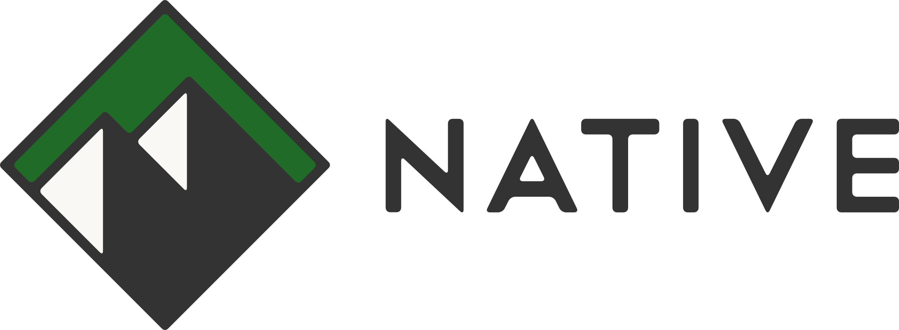
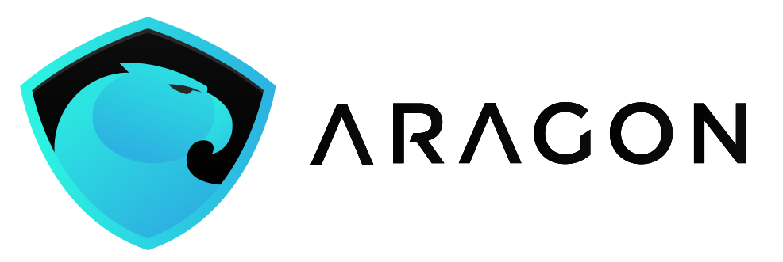

# 
Aragon Flock Proposal: Native

## **Summary**

[Native](https://nativeproject.one/) is building a financial ecosystem for a collaborative world. We provide tools and infrastructure for community-based organizations to incentivize their members, scale, and realize their value in ways not possible through the traditional financial economy.

Since its inception, Native has intended to use Aragon as a backend for each of its communities by leveraging the modular implementations that Aragon provides in the form of Templates and Apps. The decision to proceed with this integration was made after an internal set of governance tools were created for the Native prototype and once it was clear that Aragon would now be able to meet the needs of our organizations.

This provides a unique opportunity for cross-pollination between the two networks, where Native will contribute to arApps that will be useful within the greater DAO ecosystem.

## **Deliverables**

### **I01 - Network Economic Model**

The Native Economic Model is designed so that communities are incentivized to collaborate rather than compete.

#### **2SAAM Tokenomic Model**

2SAAM (pronounced "too sam") stands for “**2 S**ends **A**nd **A M**int”.

The goal is to integrate a new economic model into Aragon DAOs that enables more accurate pricing of a token and creates a continuous fundraising mechanism for an organization. 

2SAAM has three integral functions that, when combined, make a new and unique type of tokenomic model. These functions regulate the value of an organization’s token when users join and leave the organization.

1. Deposits are partially **sent** into a reserve denominated in a chosen base token - which could be NTV, ANT, or any other token type currently on the Ethereum network - to facilitate one aspect of accurate token pricing.

2. The remaining deposit is **sent** into an operating fund for the organization.

3. In turn for a deposit, an algorithmically valued number of organization tokens are **minted** and sent to the user.

This creates a uniform valuation mechanism across all organizations - and by integrating Uniswap, Bancor, and [0x](https://github.com/proofoftom/aragon-exchange), will enable the most liquidity and convertibility possible between organizations’ tokens. This, in combination with healthgrades ([I05](#i05---organization-healthgrades-and-valuations)), will provide more accurate valuations of organizations.

This model additionally considers how revenues generated by organizational efforts are cycled back into the organization. Any revenue that is earned can be split between the reserve and community fund at the organization’s chosen split ratio.

One primary function of this token type (and the associated [I06](#i06---member-experience-research-and-reporting) proposal) is that it can be functionally used as a currency in addition to representing stake in an organization (see [I02](#i02---staking-for-membership)). Community/organization currencies are important to help contain the value being transacted within an economy and to enable permissions (like member benefits - [I07](#i07---member-benefits-packages-and-physical-world-connections)) for token holders.

The reserve model is a fundamental KPI for [I05](#i05---organization-healthgrades-and-valuations) in determining the health and value of an organization.

#### **Collaborative Economic Model**

Leveraging a chosen base token for a subset of organizations’ tokens creates a network effect, so that when one community grows, the value held in reserve by the other communities also increases. This could apply to ANT, and the arApp would enable any token to be used as a base.

A focal point of Native’s research is to continuously optimize reserve ratio and reserve portfolio composition (ultimately including ANT and others) to ensure communities have an optimized balance between growth opportunity and stability in token value.

### **I02 - Staking for Membership**

The purpose of this initiative is to expand the possibilities of leveraging staked tokens in an organization and to enable the use of tokens as a liquid currency. 

Staking tokens is beneficial for a number of reasons, including:

#### **Member Registry**

A member registry for an organization serves multiple functions, including enabling the whitelist/blacklist and access scripts. In addition to these components, a registry can provide member-specific content (either for organizers or the public) and the ability to connect with members (who have chosen to be public). Connections and time with other members can be part of a benefit package such as those described in [I07](#i07---member-benefits-packages-and-physical-world-connections).

#### **Whitelist/Blacklist**

Access to organizations through staking "[I01](#i01---network-economic-model) type" tokens differentiates transferring value into an organizational asset from becoming a member of the organization.

A whitelist function within a registry enables anyone to own tokens, but still limits who is actually able to participate in governance decisions and who can complete tasks/bounties.

Blacklists enable organizations to kick someone out of the governance and operational aspects of an organization but let them keep their tokens to be used as currency.

#### **Access Scripts**

Access scripts allow for communities’ native applications or web content to only be accessible if a user is a member of the organization and/or holds a minimum number of tokens (ultimately leading to tiered access within organizations).

This can unlock entire web pages, download links, discount coupons, text content, and more. The only thing that would be required is for a developer to inject a few lines of web3 code into their website or mobile application and for the user to be browsing on a web3 browser.

### **I03 - Community Templates**

Community Templates are a method allowing organizations to deploy DAOs with a set of pre-selected governance and token economics variables. These choices are based on previous results from similar organizations. 

Templates will be created for various community verticals (examples: music festival, event, lifestyle organization, etc.) and make it simple for anyone to deploy a DAO that effectively meets their needs.

Native already has data from four pilot communities and will continue to refine for tested verticals and create outlines for untested verticals. These tested verticals and other clear verticals that emerge will be refined by the Native team and have preferred status for users with limited economics and governance knowledge.

[Related forum post](https://forum.aragon.org/t/ideas-for-improving-onboarding-and-useability-of-alba-aragon-0-6/363) - from Luke Duncan

[Related Flock notes](https://github.com/aragon/flock/blob/master/teams/Autark/2019Q1-2.md#dao-templates) - from Autark proposal, see section: DAO templates

### **I04 - Community Action Recipes**

Community growth recipes are a series of projects and tasks/bounties that are deployable within an organization to achieve a new level of growth. They can be general or vertical-specific.

For example, there could be a "gain members from Facebook" recipe that has tasks getting members to invite friends on Facebook into the organization and a project to run a social media marketing campaign (also on FB in this case).

Over time, each recipe has a success metric, and the most effective will rise to the top and be implemented across many communities/organizations.

Similar product - [Airtable Templates](https://airtable.com/templates)

### **I05 - Organization Healthgrades and Valuations**

This initiative is to more clearly understand the activity levels of each organization and how that activity correlates to its valuation. 

In a world where 40% (and increasing) of internet traffic is "fake," it is important to have insight into the underlying KPIs of an organization to determine whether or not they are creating a false image of success.  

#### **Phase 1 - Healthgrades**

The purpose of a healthgrade is to inform users whether or not an organization is in good health (or has an appropriate valuation in relation to its health) to join. Organization healthgrades are the first step to achieving a fully autonomous valuation algorithm. To begin, we have 7 KPIs to include in the healthgrade calculation, which include various economic and governance statistics. Please refer to the whitepaper to learn more.

Healthgrades are reference points to the overall activity within an organization and do not have any direct effect on the price or value of an asset. They are helpful indicators for determining when a potential organization member is eligible to join.

#### **Phase 2 - Valuations**

Once the healthgrades are created, refined, and agreed to be an effective calculation of an organization's value, Native will design a machine-learning algorithm that takes the healthgrade of an organization, adds additional KPIs focused on value, and calculates a fair market value (FMV) for an organization at any time. 

While this number does not necessarily mean that the DAO will be valued at what the FMV states, it provides a more precise reference than a healthgrade.

### **I06 - Member Experience Research and Reporting**

This initiative is to contribute (and collect) as much in-person education (and feedback) as possible via the flourishing crypto community in Denver, as well as to organize our digital feedback and ultimately leverage a TCR for member-driven prioritization of development goals.

Because Native is focused on the physical plane for onboarding organizations, we have unique insight into the local interactions that occur between humans and their relationship to participating in an organization. This form of granular reporting is valuable to the ecosystem from both an outreach and an ongoing UX perspective.

#### **Phase 1 - Meetups and Workshops**

In addition to working in close relation with Native communities and their members, we evangelize Aragon in the local community via meetups and workshops, where we’re able to collect feedback and address onboarding pain points - which affect both Native and Aragon as a whole - in a more personal setting. 

#### **Phase 2 - TCR**

Prioritization of members’ needs and desires can be optimized by staking one’s tokens on the outcome, like a vote. 

A TCR would be implemented to prioritize and align development efforts ([see District0x for TCR implementation](https://vote.district0x.io/)), as determined by NTV and ANT holders. Ultimately, the TCR could trigger capital allocations directly to specific projects, developers, contractors, etc. and make the outcomes binding.

### **I07 - Member Benefits Packages and Physical World Connections**

From our first round of community-based organization research, we learned that one of the primary reasons someone joins a community is what they will receive for joining in addition to community tokens.

Member benefits packages not only provide additional value to prospective members seeking to join, they also turn communities into products. This justifies the "cost" of joining a community.

Some examples of benefits packages may include:

* Product discounts

* Discounts at partner stores

* Free downloads

* Free access to events

* Free merchandise

* Access to permissioned content

* Entrance to a co-working space

The physical world connection of these benefits primarily relates to how they are accessed and utilized. QR codes and NFC are the clear frontrunners of interaction between planes. Native will be the first to implement and optimize these functions over time as we gather opt-in feedback from users.

### **I08 - "That Planning Suite" Reputation Modularity**

To avoid reinventing the wheel in regard to projects, tasks, and reputation, Native will build on the shoulders of TPS (That Planning Suite), which would serve as a projects and tasks manager *frontend* to a **Merit Manager** *backend*, in turn serving to standardize reputation.

With this approach, we will work in coordination with Autark to provide an integration with TPS and the pluggable Merit Manager backend without requiring any changes to TPS or the core Aragon infrastructure. This would allow Autark to develop its own default reputation plugin for TPS as well in the future.

We will first focus on developing an opt-in **Colony Connection** plugin to TPS that provides immediate utility and security (they are [currently being battle tested](https://docs.colony.io/colonynetwork/bug-bounty-program-overview)) and brings immediate capability to the ecosystem.

**The *necessity* for a modular approach to TPS (and reputation specifically) follows the same logic as Aragon utilizing modularity in its DAOs: the underlying software needs to be flexible enough for any organization’s implementation.

This approach allows for pluggable modularity, much akin to web 2.0 CMSs, such as WordPress and Drupal, where organizations can fulfill their mission-specific requirements (i.e., an ecommerce store) without being locked in to opinionation (i.e., can *only* use Authorize.net as a payment processor) by having multiple plugins that extend upon the commerce plugin itself (i.e., can use Wyre *or* Bitpay if one so chooses).**

#### **Community Token vs Merit Token**

In Native’s implementation of the reputation system, there will be a separation between a community’s token, which represents its **currency**, and one’s **reputation** within a community, represented by a secondary, non-transferable token managed by the Merit Manager, which is driven by a swappable reputation validation backend (i.e., the Colony Network’s [Reputation Mining](https://docs.colony.io/colonynetwork/docs-reputation-mining/)).

#### **Merit Manager and Voting Apps**

* Modular - **no** changes to the core Token Manager or Voting apps will be required

* One will be able to earn reputation (minted and assigned by the Merit Manager) from within Aragon by participating in votes and surveys

    * [https://github.com/aragoncoop/ops/issues/2](https://github.com/aragoncoop/ops/issues/2)

* Allows for emergent membership by earning reputation via Colony Network tasks

* Provides interface for permanent wrapping and burning of a specified existing token into non-transferrable reputation (for migrating existing communities)

* Merit Voting is mutually exclusive with traditional Voting, as community tokens are uncounted in merit votes (weighted equity/merit voting will come later)

#### **Merit Connections**

Merit Manager extensions for leveraging 3rd-party smart contracts or oracles for reputation include:

* Colony (**phase 1**)

* Games!

* Reddit ([Daonuts](https://www.reddit.com/r/daonuts))

* Discourse

* Wordpress

* Karma bots (Rocket.chat, Discord, Slack, etc)

* Attack vectors a'hoy!

Ultimately, the list of most reputable oracles will be perpetually weighted through a TCR.

#### **Experimenting with a Sandboxed Testnet**

A ["one-click" deployment](https://github.com/DenverDAO/COMStack) will be provided for launching an opt-in test network of interconnected reputation organizations with the above **Merit Connections** installed to provide a sandbox environment for experimenting.

### **I09 - Gamification**

Gamification of various processes related to creating, joining, and building communities will have two major effects on the engagement and retention of users within organizations:

1. Education embedded into the gamification, which informs the users of what they should do next to reach a certain level

2. Incentive mechanisms to remain engaged within communities and the broader Native networks

Gamification is highly integratable with [I04](#i04---community-action-recipes), in which completing certain recipes can lead to earning badges at both the organizational and individual levels; as well as [I08](#i08---that-planning-suite-reputation-modularity), in which users gain reputation from contributing to an organization.

For example, a gamified badge/milestone could be to join three organizations, and that could be rewarded with an NFT and/or a defined number of ANT, NTV, community tokens, reputation, etc.

The education and gamification synthesis will remove a lot of friction associated with onboarding members onto web3 and the Aragon/Native networks. Beginner badges for doing simple tasks can get a user’s profile to "100% completion" and ensure that they are both engaged in the learning process and incentivized.

### **I10 - Connect API**

The purpose of this initiative is to provide the ability for app developers to gain insight into - and interact with - an organization via an API. Native would contribute and maintain these APIs as a service for its communities.

As a proof of concept, we’ve deployed a couple of subgraphs to TheGraph, such as an [individual DAO explorer](https://thegraph.com/explorer/subgraph/proofoftom/aragon-dao) and an [Aragon Network explorer](https://thegraph.com/explorer/subgraph/proofoftom/aragon-network), to show how these insights can be implemented on a DAO or network level and thus be utilized via a modern GraphQL querying frontend framework such as Gatsby.js or Gridsome.

In relation to healthgrades for organizations [[I05](#i05---organization-healthgrades-and-valuations)], these subgraphs will provide some of the metrics for an organization’s assessment.

In the not too distant roadmap we’d be contributing a **Services** arApp to provide permissioned endpoints for interacting (i.e., voting) with any DAO using any front end interface (i.e., Native) and utilizing authentication via any web3 provider (i.e., frame.sh).

## **Grant size**

We request **$599k** paid in DAI to cover six months of operating costs. These funds would be used as follows:

### **Estimated operating costs for six months**

Payroll     $462k

Software Services     $7k

Legal and Accounting     $45k

Travel, Conferences      $40k

Office, Equipment, Laptops      $45k

Total     $599k

### **ANT package**

We would like to request **600k** ANT with 1-year cliff and 4-year vesting to incentivize employees and reinforce long term commitment to Aragon.

## **Team**

The team is partially remote but generally local to Colorado. We have an office in Denver. This is what our team will look like once funded:

* Management

    * Jake Vartanian - [linkedin](https://www.linkedin.com/in/jakevartanian/), [twitter](https://twitter.com/JakeVartanian)

* Development

    * Tommy Cox - [Aragon Developer Relations application](https://forum.aragon.org/t/developer-relations-opening-application-is-this-hiring-aragon-one-just-kidding/616)

    * Dekan Brown - [github](https://github.com/dekanbro), [twitter](https://twitter.com/DekanBro)

    * Sam Kuhlmann - [github](https://github.com/skuhlmann), [linkedin](https://www.linkedin.com/in/samkuhlmann/)

    * Cody Taft - [linkedin](https://www.linkedin.com/in/codytaft/), [github](https://github.com/codytaft)

    * Additional Developers - [bountied](https://gitcoin.co)

* UI/UX Lead

    * Ven Gist - [some works](http://www.vengist.com/works), [linkedin](https://www.linkedin.com/in/vengist/), [github](https://github.com/oovg)

* Ecosystem/Community Development

    * Jorgen Bo - [linkedin](https://www.linkedin.com/in/fixeroslo/)

* Project Manager - contracted

* HR Manager - contracted

* Marketing - contracted

