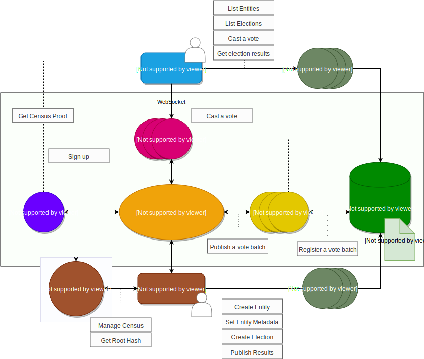

# Summary
Vocdoni is a global project that builds tools for anonymous, censorship resistant and end-to-end verifiable voting. To this end, we are requesting Aragon Flock funding in order to produce a production-ready suite of backend components and client libraries, alongside an Aragon module to integrate these capabilities. This proposal is for six months' funding, and is being submitted for consideration as part of AGP 3, to be held 25-27 July, 2019. As such, the timeline runs from August 2019 to January 2020.

Our aim is a trustless voting system, where anyone can speak their voice and where everything can be audited. We are engineering building blocks for a permissionless, private and censorship resistant democracy and we belive that our outputs will be extremely valuable to the Aragon ecosystem. 

We intend the algorithms, systems, and software that we build to be a useful contribution toward making "violence in these cryptonetworks impossible by protecting users' privacy with cryptography." In particular, our aim is to provide the necessary tooling for the political will of network participants to translate outwardly into real political capital, without sacrificing privacy.

In concrete terms, our intent is to apply our research so that Aragon DAOs and other organizations can conduct voting processes that provably account for particular properties of their participants (age, location, or membership for example) - without revealing this data in the course of voting. 

# Technology Overview
A Vocdoni voting process makes use of the following components:

Data integrity is provided by the public blockchain Ethereum main net.
Data availability is provided by a distributed filesystem such as Swarm or IPFS.
Peer messaging is provided by the distributed messaging protocol Swarm/PSS.
The client interface (app or webapp) interacts with the P2P network and the Blockchain through Gateways (using WebSockets or HTTP/RPC).
Gateways are neutral/agnostic, since the cryptographic layer happens on the peer side. The only intent of a Gateway is about forwarding requests from clients that can't open a socket by themselves (typically web browsers).

Before starting a voting process, the organizer collects a census of all valid voters and then publishes a Merkle tree of all public keys that are eligible to vote. 
The process metadata, as well as the census Merkle tree, is pinned on a decentralized filesystem. A transaction is sent to the blockchain to persist the vote details. 

Now that the process has begun, users can vote. In order to ensure complete voter anonymity, each user packages their vote using either a Linkable Ring Signature (LRS) or a Zero-Knowledge Proof (ZK-Snark). 
LRS allows each individual in a group of users (in this case a chunk of the census) to compute a ring signature which can be validated by all other members of the group without revealing the identity of the signer. Each signature can be verified as belonging to a valid signer, but that signer's identity is unknown other than their membership in a census chunk. 

ZK-Snark is an extremely fast and private method for proving the validity of a voter. The method allows a user to convince a verifier that it possesses a valid vote and belongs in the census without revealing any information about the voter or the vote itself. 

The user then submits the LRS- or ZK-Snark verified vote to a Gateway, which using PSS forwards it to a Relay. 

When a relay receives a vote package, it first validates the external payload and then groups it with other vote packages. Once enough votes are ready, it pins the vote data to swarm and then registers the batch to the blockchain. 

After a process ends, the organizer publishes a private key to decrypt the submitted vote packages. From this moment, any node on the network can start counting and validating votes.

# Deliverables

## I01 - Entity Services
The goal of this work package is to create all of the services and supporting infrastructure necessary for organizations to conduct and scale voting processes.

### Components
#### Entity Manager
Application and API allowing organizations of all types to manage collections of user public keys and create voting processes. Census maintainers can set their own criteria for the inclusion of keys in any particular census.
#### L2 Suite
Tool suite enabling easy, secure deployment of supporting L2 infrastructure. The purpose of this supporting infrastructure is to  offload computation and coordination effort from the EVM, thereby improving performance and reducing cost. This can be done is such a way that there is no loss of data integrity. Gives stakeholder organizations a way to deploy and scale gateways and relay nodes that coordinate activity accross themselves, mobile users, the blockchain, and content-addressable storage.
#### Aragon Module
Aragon module integrating the capabilities of the Entity Manager and interaction with L2 Suite components in a modular and reusable way, offering any Aragon DAO the ability to easily integrate cost-effective verifiable voting.

### Roadmap
##### August
* Alpha release of entity mangaer. User feedback and testing with stakeholder organizations.
##### September
* Alpha release of L2 Suite. Burn-in testing and performance optimaization.
##### October
* Alpha release of Aragon module. Process testing and scalability evaluation.
##### November
* Beta release of entity manager. Feature complete and refined user flows.
##### December
* Beta release of L2 Suite. Large-scale testing and failure-mode evaluation. Secure, high-availability packaging and release pipeline.
* Begin comprehensive security audit. 
* Beta release of Aragon module.
##### January
* Finish external security audit of all components. Break-fix and user-requested enhancements.
* Wide release

## I02 - Client Libraries
The goal of this work package is to create client applications for participating in voting processes.

### Components
#### Petition App
Mobile client application allowing users to digitally sign petitions.
#### Voting App
Mobile client application enabling users to cast anonymous votes using Linkable Ring Signatures and/or Zero-knowledge proofs.
#### Aragon App
Aragon module enabling client-side verified voting capabilities.

### Roadmap
##### August
* Alpha release of petition app. User feedback and refinement of overall experience.
##### September
* Beta release of petition app. Feature complete and polished.
##### October
* Alpha release of voting app, with LRS voting. Feeback on vote UI.
##### November
* Alpha release of Aragon app. 
* Testing and tuning of voting performance.
* Beta release of Voting app. Testing at scale.
##### December
* Beta release of Aragon app.
* Begin comprehensive security audit.
##### January
* Finish external security audit of all components. Break-fix and user-requested enhancements. 

# Grant Details
## Operating Costs
* $450,000.00 paid in DAI

⋅⋅⋅ 250,000.00 - dev costs

⋅⋅⋅ 175,000.00 - security auditing

⋅⋅⋅ 25,000.00 - outreach

## ANT Package
* 20,000.00 ANT per team member, for a total of 100,000 ANT, with a one year cliff and four year vesting structure. 

## Structure
Our team is primarily located in and around Barcelona, with one member in Berlin. Our workflows are remote-first and conducted in English.

# Team
## Pau Escrich
Pau Escrich is first and foremost an activist and hacker. He holds a Bachelor's degree in Computer Engineering and a Master's degree in Free/Open Source Software, and has wide experience as an enterprise systems administrator. He has worked in academia as a researcher on distributed networks and systems, and has been a principal contributor to many p2p network projects, such as LibreMesh.org and Guifi.net. He has been active in the blockchain world since 2012. He developed and managed a mining pool in 2014 and built open source tools related to the Stratum protocol. For the last two years he has been working as a freelance consultant on security, privacy, blockchain, networks, and distributed systems.

## Xavi Vives
Xavi Vives is a maker. He has worked as a software engineer for most of his professional career, building interactive experiences, games, and real-time visualizations. Bitcoin inspired a lasting shift in his interests, with its potential to bring social and economic systems into greater alignment with his personal values. He has executed extensive research and prototyping around both decentralized meritocratic governance and personal distributed archives. After the censorship suffered in Catalonia in October 2017, he decided to put all his efforts into accelerating mass adoption of this technology.

## Jordi Moraleda
Jordi Moraleda is a computer scientist, musician, culture and freedom lover. He holds a Bachelor's in Computer Engineering, and a Masters in Marketing. He began his career with multinationals including Indra and IBM, before he took a step back and started to invest into entrepreneurial projects. This led him to co-found a tech startup and a digital agency, alongside freelance projects and vocational endeavours involving independent music bands, recording studios, and political organizations. As a computer engineer he is currently focused on full-stack development, software architecture, UI/UX, and decentralized platforms that can make a change.

## Jordi Painan
Jordi Pinyana is a student of computer engineering. He has focused his professional career on projects that can help solve global problems. He co-created a smartphone app that detected attention deficit disorders in infants through an interactive reading game. He started in the crypto world in 2014 and has been dedicated to it full time since 2016. He has worked on blockchain solutions for several multinational firms and lectures about Parity/Ethereum at the Polytechnic University of Catalonia blockchain masters program, as well as various bootcamps. He firmly believes that through decentralization, which starts with participation, many of the problems that have always worried him could be solved.

## Isaac Wilder
Isaac Wilder is a network, systems, and software engineer with expertise in high performance computing and distributed systems. He has built systems used by some of the world's largest companies. He is the co-founder and former Executive Director of the Free Network Foundation, where he and his team won the 2011 Contact Innovation Prize and were shortlisted for the 2012 Access Innovation Prize. He has been playing with blockchains since 2010 and is based in sunny Berlin.

